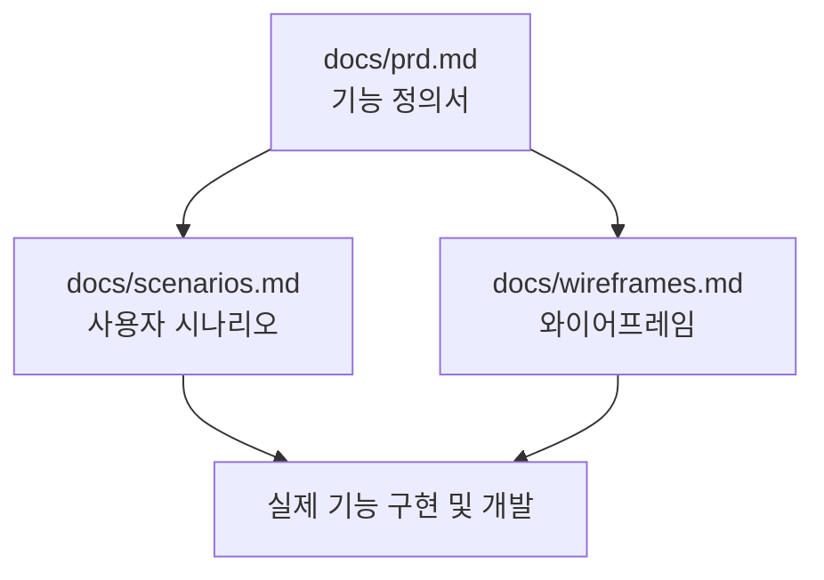

# [PRD] 링크트리 클론 서비스 "마이링크 (MyLink)" 기능 정의서

본 문서는 **마이링크(MyLink)** 서비스의 핵심 제품 요구사항 정의서(PRD)입니다. 향후 작성될 **사용자 시나리오(User Scenarios)**와 **와이어프레임(Wireframes)**의 기준점이 되는 설계도 역할을 합니다.

---

## 1. 프로젝트 개요

### 1.1 프로젝트명
* **마이링크 (MyLink)**

### 1.2 목적
* 인스타그램, 틱톡, 트위터 등 주요 SNS 플랫폼의 '프로필 내 단 하나의 링크만 허용'하는 제약을 극복합니다.
* 사용자가 개성 있는 개인 프로필 페이지를 커스텀하여 자신의 다중 링크와 소셜 미디어 정보를 한눈에 보여줄 수 있는 마이크로 랜딩 페이지 서비스를 제공합니다.
* 직관적이고 미려한 UI/UX를 제공하여, 비개발자 사용자도 수분 내에 나만의 링크 페이지를 구축하고 배포할 수 있도록 지원합니다.

### 1.3 대상 사용자
* **SNS 크리에이터 및 인플루언서**: 유튜브, 인스타그램, 깃허브, 블로그 등 여러 플랫폼의 채널을 동시에 홍보하고자 하는 사용자.
* **1인 창업자 및 브랜드 마케터**: 자사 쇼핑몰, 이벤트 페이지, 카카오톡 채널 등을 한곳에서 모아 잠재 고객에게 연결하려는 사용자.
* **프리랜서 및 구직자**: 포트폴리오, 이력서, 링크드인 프로필 등을 시각적으로 정리하여 전달하고자 하는 사용자.

---

## 2. 핵심 기능 정의 (필수 vs 선택)

### 2.1 필수 요구사항 (Must-Have)

#### [회원 관리 및 계정 설정]
1. **이메일 회원가입 및 로그인**
   * 사용자 식별 및 데이터 관리를 위한 이메일 인증/가입 시스템.
   * 비밀번호 단방향 암호화 및 토큰 기반 세션 관리.
2. **고유 도메인 주소 선점**
   * 회원가입 시 고유의 `username` 설정.
   * 실제 접속 주소는 `https://mylink.to/{username}`의 형태로 구현.
   * `username`은 영문 소문자, 숫자, 하이픈(-)만 허용하며 실시간 중복 체크 적용.

#### [어드민 대시보드 - 링크 관리]
3. **링크 추가, 수정, 삭제 (CRUD)**
   * **링크 추가**: 제목(Title)과 실제 주소(URL)를 입력하여 새 링크 카드 생성. URL 유효성 검사 필수.
   * **링크 노출 토글**: 삭제하지 않고도 해당 링크를 사용자 화면에서 숨길 수 있는 활성화/비활성화 스위치 제공.
   * **링크 수정**: 입력된 제목과 URL을 즉시 변경하고 대시보드에 반영.
   * **링크 삭제**: 경고 모달을 통해 영구 삭제 수행.
4. **드래그 앤 드롭 정렬**
   * 대시보드에 등록된 링크 카드의 노출 순서를 드래그 앤 드롭 방식으로 상하 조정 가능하게 함.
   * 저장 버튼 없이 마우스를 놓는 즉시 DB 순서 인덱스가 변경 및 저장되어 라이브 반영됨.

#### [어드민 대시보드 - 디자인 설정]
5. **프로필 커스텀**
   * 프로필 아바타 이미지 업로드 및 크롭 기능.
   * 프로필 타이틀(닉네임/브랜드명, 최대 20자) 및 소개글(최대 80자) 설정.
6. **디자인 테마 선택**
   * 기본 제공되는 4종 이상의 테마 템플릿(Classic Light, Modern Dark, Pastel Pink, Emerald Green 등).
   * 각 테마는 고유의 [배경색/그라데이션, 버튼 라운드 크기, 글자 색상, 폰트 스타일]을 가짐.
7. **실시간 모바일 미리보기 (Live Preview)**
   * 대시보드 우측 화면에 모바일 기기 프레임의 컴포넌트 배치.
   * 링크 추가/삭제, 프로필 수정, 테마 변경 등의 작업이 모바일 미리보기에 실시간 렌더링되도록 구현.

#### [사용자 랜딩 페이지]
8. **반응형 모바일 퍼스트 페이지**
   * 사용자의 실제 고유 주소(`mylink.to/{username}`) 접속 시 보이는 외부 페이지.
   * 100% 모바일 친화적인 반응형 웹 페이지로 구현.
   * 등록된 모든 활성화 링크가 리스트 형태로 나열되며, 클릭 시 새 탭(`_blank`)으로 연결.

---

### 2.2 선택 요구사항 (Nice-to-Have)

1. **소셜 간편 로그인**
   * Google, Kakao OAuth 2.0 API 연동을 통한 손쉬운 접근성 보장.
2. **소셜 아이콘 연동**
   * Instagram, YouTube, Twitter, GitHub 등 주요 SNS 링크 전용 아이콘 설정.
   * 텍스트 링크 버튼의 상단 또는 하단에 심플한 아이콘 모음으로 일렬 배치.
3. **방문자 및 클릭 통계 분석**
   * 전체 프로필 방문 횟수(PV) 및 고유 방문자 수(UV) 집계.
   * 등록된 개별 링크별 클릭 횟수 및 기간별 클릭 트렌드 차트(그래프) 시각화.
4. **검색엔진 최적화(SEO) 및 Open Graph 설정**
   * 검색엔진 등록을 위한 메타 태그 최적화.
   * 링크 공유 시 SNS(카카오톡, 슬랙 등)에 보여줄 공유 타이틀, 설명글, 공유 썸네일 이미지 설정.

---

## 3. 기술 스택 제안 및 시스템 구성

### 3.1 기술 스택
* **Frontend**: React + Vite, Vanilla CSS (컴포넌트 단위 스타일링, 빠른 렌더링 및 모바일 최적화)
* **Backend & Database (선택안 1)**: Firebase (Authentication + Firestore + Storage)
  * 신속한 MVP(Minimum Viable Product) 제작 및 서버리스 데이터 흐름에 용이.
* **Backend & Database (선택안 2)**: Supabase (PostgreSQL + PostgREST + Auth)
  * 관계형 DB의 무결성과 복잡한 통계 쿼리를 지원하며 RESTful API를 즉시 활용 가능.

### 3.2 데이터베이스 스키마 설계안 (초안)

#### User 테이블 (회원 계정 및 설정)
```json
{
  "id": "String (PK, UUID)",
  "email": "String (Unique)",
  "username": "String (Unique, mylink.to/{username}에 사용)",
  "profile_title": "String (기본값: username)",
  "profile_bio": "String (한 줄 소개, 최대 80자)",
  "profile_image_url": "String (Storage 업로드 경로)",
  "theme_id": "String (선택된 테마 ID)",
  "created_at": "Timestamp"
}
```

#### Link 테이블 (사용자가 등록한 링크 목록)
```json
{
  "id": "String (PK, UUID)",
  "user_id": "String (FK -> User.id)",
  "title": "String (링크 버튼에 표시될 텍스트)",
  "url": "String (실제 연결될 외부 URL)",
  "order_index": "Integer (정렬 순서)",
  "is_active": "Boolean (활성화 여부)",
  "created_at": "Timestamp"
}
```

#### Theme 테이블 (사전 정의된 디자인 테마)
```json
{
  "id": "String (PK)",
  "name": "String (테마 이름)",
  "bg_type": "String (color / gradient / image)",
  "bg_value": "String (예: #ffffff, linear-gradient(...))",
  "button_bg": "String (버튼 배경색)",
  "button_color": "String (버튼 텍스트 색상)",
  "button_radius": "String (예: 4px, 30px, 0px)",
  "font_family": "String (적용할 폰트 패밀리)"
}
```

#### Analytics 테이블 (링크 클릭 및 조회수 로그)
```json
{
  "id": "String (PK, UUID)",
  "user_id": "String (FK -> User.id, 프로필 주인)",
  "link_id": "String (FK -> Link.id, Null이면 프로필 방문 자체를 의미)",
  "device": "String (mobile / desktop)",
  "referrer": "String (유입 채널: instagram, facebook, direct 등)",
  "clicked_at": "Timestamp"
}
```

---

## 4. 문서 연계 및 향후 계획

마이링크 프로젝트 설계 문서는 다음과 같은 구조로 연계되어 구체화될 예정입니다.



* **[사용자 시나리오](./scenarios.md)** (작성 예정)
  * 사용자가 처음 가입해서 자신의 링크 트리를 배포하기까지의 행동 흐름(User Flow) 정의.
  * 오류 발생 시나리오(중복 주소 입력 시, 올바르지 않은 URL 입력 시 대응 등) 정의.
* **[와이어프레임](./wireframes.md)** (작성 예정)
  * 어드민 대시보드(데스크톱 및 태블릿 화면)의 레이아웃 배치 기획.
  * 모바일 뷰어용 실제 프로필 페이지의 시각적 컴포넌트 크기 및 간격 기획.
