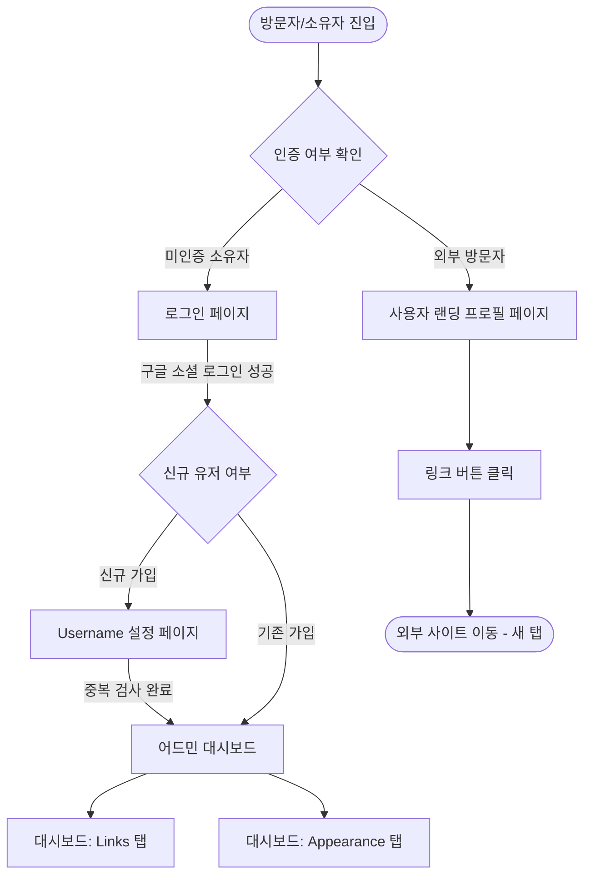

# 마이링크 (MyLink) 와이어프레임 및 화면 설계서

본 문서는 **마이링크(MyLink)** 서비스의 주요 화면 레이아웃과 화면 간 이동 흐름을 정의합니다. 최대한 링크트리(Linktree) 서비스와 직관적으로 유사하면서도 미니멀하게 설계되었습니다.

---

## 1. 화면 이동 흐름 (User Flow)

사용자가 서비스에 접근하여 로그인하고, 관리 및 배포하는 일련의 흐름을 나타낸 다이어그램입니다.



---

## 2. 화면별 와이어프레임 (ASCII Art & 구조 설명)

### 2.1 로그인 페이지 (Login Page)
* **목적**: 오직 구글 소셜 로그인을 통해서만 접근할 수 있는 심플한 첫 진입 화면입니다.

```text
======================================================
                     🔗 MyLink
======================================================

          나만의 모든 링크를 단 하나로 연결.
             개발자와 크리에이터를 위해.

             +--------------------------+
             |   G  Continue with Google|
             +--------------------------+

======================================================
```

#### 주요 컴포넌트 정보 (shadcn/ui 구성요소 매핑)
* **로고 & 슬로건**: 페이지 중앙에 배치된 메인 로고 텍스트.
* **구글 로그인 버튼 (`Button`)**: shadcn/ui 기본 버튼 모양에 구글 로고 아이콘이 들어간 컴포넌트.

---

### 2.2 고유 주소(Username) 설정 페이지
* **목적**: 구글 로그인을 최초로 마친 신규 유저가 자신만의 단일 링크 주소를 생성하는 화면입니다.

```text
======================================================
                    설정 완료하기
======================================================

  마이링크 주소에 사용할 고유 아이디(username)를 입력하세요.
  
  주소: mylink.to/ [ username                 ]
                   [ 영문 소문자, 숫자, 하이픈(-) ]
  
             +--------------------------+
             |         시작하기         |
             +--------------------------+

======================================================
```

#### 주요 컴포넌트 정보
* **주소 입력창 (`Input`)**: 사용자가 `username`을 입력할 폼 컴포넌트. 실시간 정규식 유효성 및 DB 중복 체크 문구가 입력창 아래에 헬퍼 텍스트로 노출됩니다.
* **제출 버튼 (`Button`)**: 유효성 검사를 통과한 상태에서만 활성화되는 버튼.

---

### 2.3 어드민 대시보드 - Links 탭 (Admin Dashboard - Links)
* **목적**: 사용자가 자신의 링크들을 추가하고, 기존 링크의 이름과 URL을 수정하고 삭제할 수 있는 공간입니다.

```text
======================================================
  [🔗 MyLink]            [Links]   [Appearance]  [Logout]
======================================================

  +------------------------------------------------+
  |                   + Add Link                   |
  +------------------------------------------------+

  +------------------------------------------------+
  |  [Favicon]  Naver Blog                         |
  |  https://blog.naver.com/myblog                 |
  |                                     [🗑️ Delete] |
  +------------------------------------------------+

  +------------------------------------------------+
  |  [Favicon]  My GitHub                          |
  |  https://github.com/mygit                      |
  |                                     [🗑️ Delete] |
  +------------------------------------------------+

======================================================
```

#### 주요 컴포넌트 정보
* **네비게이션 바 (`NavigationMenu`)**: 어드민 페이지 상단에 위치하여 `Links`, `Appearance` 탭 전환 및 `Logout` 기능 제공.
* **링크 추가 버튼 (`Button`)**: 클릭 시 즉시 폼을 열거나 하단에 새로운 링크 추가 카드를 생성.
* **링크 아이템 카드 (`Card`)**:
  * **[Favicon]**: 입력된 URL 도메인에 매핑된 파비콘 이미지 노출 영역.
  * **텍스트 필드**: 제목과 URL을 관리자가 인라인 형태로 즉시 더블클릭/포커스하여 수정할 수 있도록 구성.
  * **삭제 버튼**: 휴지통 모양 아이콘 및 'Delete' 텍스트 컴포넌트.

---

### 2.4 어드민 대시보드 - Appearance 탭 (Admin Dashboard - Appearance)
* **목적**: 디스플레이 네임, 소개글, 프로필 이미지를 설정하고 랜딩 페이지의 테마를 변경합니다.

```text
======================================================
  [🔗 MyLink]            [Links]   [Appearance]  [Logout]
======================================================

  Profile
  +------------------------------------------------+
  |   ( Avatar )       [ Upload Image ] [ Remove ] |
  |                                                |
  |   Display Name                                 |
  |   [ displayname                              ] |
  |                                                |
  |   Bio                                          |
  |   [ 한 줄 소개를 작성해 주세요...             ] |
  +------------------------------------------------+

  Themes
  +------------------------------------------------+
  |  +------------+  +------------+  +------------+|
  |  |   Light    |  |    Dark    |  |  Terminal  ||
  |  +------------+  +------------+  +------------+|
  +------------------------------------------------+

======================================================
```

#### 주요 컴포넌트 정보
* **프로필 설정 영역 (`Card`)**:
  * **아바타 (`Avatar`)**: 둥근 모양의 프로필 이미지 뷰어 컴포넌트.
  * **이미지 업로드/삭제 버튼 (`Button`)**: Firebase Storage와 연동되는 이미지 파일 선택기.
  * **입력창 (`Input` / `Textarea`)**: 디스플레이 네임(displayName) 및 한 줄 바이오(bio) 입력 상자.
* **테마 선택 영역**:
  * 사각형 형태의 카드 버튼 리스트로 구성되며, 클릭 시 즉시 프로필 페이지의 배경 및 버튼 UI 스타일 프리셋이 업데이트됨.

---

### 2.5 사용자 랜딩 프로필 페이지 (User Landing Page)
* **목적**: 외부 방문자가 마이링크 주소(`mylink.to/{username}`)로 진입했을 때 보게 되는 최종 결과 화면입니다. (모바일 뷰 최적화)

```text
======================================================
|                                                    |
|                     ( Avatar )                     |
|                                                    |
|                    @displayName                    |
|               한 줄 소개글 문구 출력               |
|                                                    |
|     +----------------------------------------+     |
|     | [Favicon]          Naver Blog          |     |
|     +----------------------------------------+     |
|                                                    |
|     +----------------------------------------+     |
|     | [Favicon]          My GitHub           |     |
|     +----------------------------------------+     |
|                                                    |
|                                                    |
|                     🔗 MyLink                      |
|                                                    |
======================================================
```

#### 주요 컴포넌트 정보
* **사용자 프로필 헤더**:
  * 업로드된 아바타 이미지가 중앙 정렬로 배치.
  * 하단에 굵은 볼드 서체의 `@displayName` 출력.
  * 그 아래에 디스플레이 네임보다 흐리고 가독성 좋은 텍스트 크기의 소개글 배치.
* **링크 버튼 리스트 (`Button`)**:
  * 링크트리와 가장 유사하게 가로 영역을 채우는 둥근 모서리(rounded) 스타일의 버튼 카드들.
  * 각 버튼은 **[Favicon]** 아이콘이 제일 왼쪽 끝에 마진을 두고 위치하고, 링크 **제목 텍스트**가 버튼 중앙에 대칭으로 배치되는 구조.
* **마이링크 워터마크**:
  * 화면 가장 최하단에 배치되는 "🔗 MyLink" 브랜딩 텍스트.
